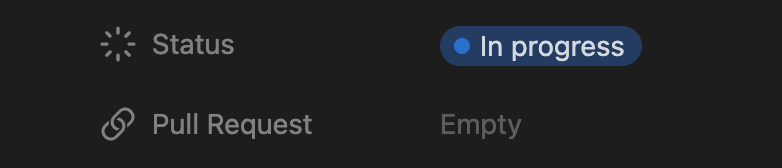

# danger-plugin-notion-tasks

[](https://badge.fury.io/js/@heritageholdings/danger-plugin-notion-tasks)

This [Danger](https://danger.systems/js/) plugin manages Notion pages automatically based on a Pull Request status.

## Quickstart

### Notion setup

First of all an **Internal Integration Token** is needed in order to manage the connection between GitHub and Notion. Follow the steps in [this tutorial](https://www.notion.so/help/create-integrations-with-the-notion-api#create-an-internal-integration) to generate one and store the token for later.

Now create a Notion page with a `Status` [status property](https://www.notion.so/help/guides/status-property-gives-clarity-on-tasks) and a `Pull Request` [url property](https://www.notion.so/help/database-properties#basic-properties). The most common scenario is a database of tasks where each task is a page with the described properties among others:



### Configuration

1. Install the `danger-plugin-notion-tasks` plugin using your favourite package manager:

```sh
// Yarn
yarn add --dev @heritageholdings/danger-plugin-notion-tasks

// NPM
npm install -D @heritageholdings/danger-plugin-notion-tasks
```

2. Add the following code to your `dangerfile`:

```ts
notionSync({
  // This should be the user that owns the pages.
  //
  // For example:
  // https://www.notion.so/this-is-the-username/Page-1069eef615114va810dfg797219147fb
  //                       --------------------
  notionUser: "notion-page-username",

  // How the page's Status should be changed
  // based on the Pull Request lifecycle.
  prStatusMap: {
    open: "In progress",
    closed: "Done",
    merged: "Done",
    locked: "Done",
  },
});
```

3. Make the Danger bot run everytime a Pull Request changes:

```yml
on:
  pull_request:
    types:
      - opened
      - synchronize
      - reopened
      - edited
      - closed
```

4. In your GitHub repo add a new [GitHub Secret](https://docs.github.com/en/actions/security-guides/encrypted-secrets) `NOTION_TOKEN` with the token generated in the previous section from Notion.

### Trigger

Create a new Pull Request and add everywhere in the description:

```
Closes https://www.notion.so/this-is-the-username/Your-Notion-Page-1069eef615114va810dfg797219147fb
```

This Notion page will be recognized by the Danger bot and managed based on the PR status. For example, opening the PR will change the page Status to `In progress` and merging it to `Done` following the default configuration above. The PR link will be also added to the `Pull Request` property.

In this case `closes` (not case sensitive) in one of the default keywords used by this plugin to recognize a target Notion page. By default all the [GitHub keywords](https://docs.github.com/en/get-started/writing-on-github/working-with-advanced-formatting/using-keywords-in-issues-and-pull-requests) are supported, but it's possible to change them through the `triggerWords` setting.

## Changelog

See the GitHub [release history](https://github.com/dgopsq/danger-plugin-notion-tasks/releases).
